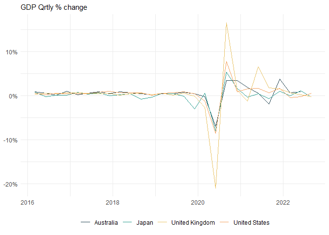

## Column

### Chart A

    available_indicators <- get_oecd_avlble_indctors_DPLIVE()

    GDP_based_indicators <- available_indicators %>%
      dplyr::filter(stringr::str_detect(indicator_desc, "GDP|gdp")) %>%
      dplyr::pull(INDICATOR)

    GDP <- get_oecd_data_DP_LIVE(
      indicators = GDP_based_indicators,
      countries = c("USA", "AUS", "JPN", "GBR"),
      start_time = 2016,
      end_time = 2021
    )

    color_scale <- c("#264653", "#2A9D8F", 
                     "#E9C46A", "#F4A261", "#E76F51")

    p1 <- GDP %>% 
      dplyr::filter(!is.na(date)) %>%
      dplyr::filter(.data$indicator_desc == "Quarterly GDP") %>%
      dplyr::filter(.data$measure_desc == "Percentage change, previous period") %>%
      ggplot2::ggplot(ggplot2::aes(x = .data$date, 
                                  y = .data$obsValue/100, 
                                  color = .data$country)) +
        ggplot2::geom_line() +
        ggplot2::theme_minimal() +
      ggplot2::scale_y_continuous(labels = scales::label_percent())+
      ggplot2::scale_color_manual(values = color_scale) +
      ggplot2::labs(subtitle = c("GDP Qrtly % change", "GDP Qrtly % change")) +
      ggplot2::theme(
        legend.position = "bottom", 
        axis.title =  ggplot2::element_blank(), 
        legend.title = ggplot2::element_blank()
      )

    plot(p1)

## Column

### Chart B

### Chart C
